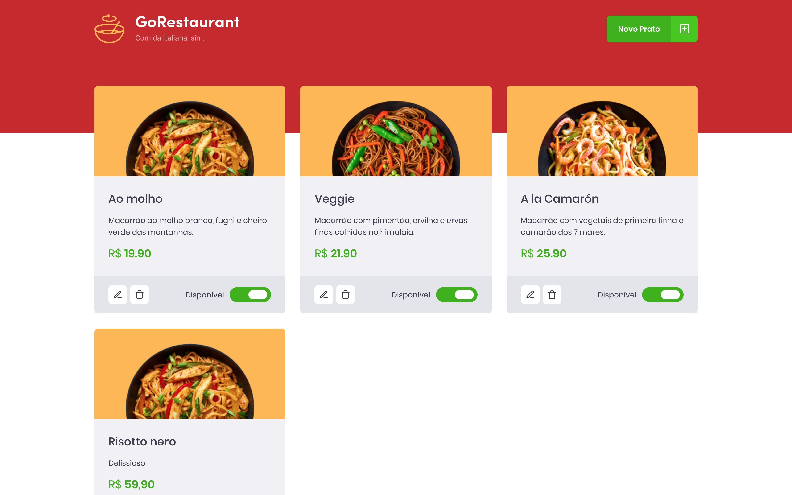

# 👨‍🍳 About
Interface for restaurant menu management and dishes creation



# 💻 Test locally

## Using yarn
```sh
# Start the json server fake api and run development server
yarn
yarn json-server server.json -p 3333 & yarn start
```
OR

## Using npm
```sh
# Start the json server fake api and run development server
npm install
npx json-server server.json -p 3333 & npm start
```


